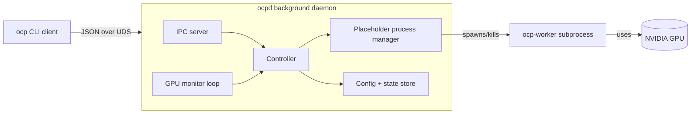

# OCP — Project Plan

A client/server tool ("ocp" = **O**ccupy **C**ompute **P**rocess) that watches GPU utilization & memory and, when the device is idle, launches a placeholder workload to keep it occupied. A CLI client talks to a background daemon.

---

## 1. High-Level Architecture



Three independent processes:
1. **`ocp` (client)** — short-lived CLI, sends a request, prints a response.
2. **`ocpd` (daemon)** — long-lived; owns the monitor loop, the IPC server, and the placeholder lifecycle.
3. **`ocp-worker` (placeholder)** — child process the daemon spawns to actually consume GPU; killable independently.

Separating worker from daemon means the daemon can restart/upgrade without losing the placeholder, and a crashed worker can't take the daemon down.

---

## 2. Technology Choices

| Concern | Choice | Why |
|---|---|---|
| Language | **Python 3.10+** | First-class GPU bindings (`pynvml`), good CLI libs, fast to iterate |
| CLI framework | **Typer** (or Click) | Clean subcommand UX, autogenerated `--help` |
| GPU telemetry | **pynvml** (NVIDIA NVML) | Official, no `nvidia-smi` parsing, gives util% + mem |
| IPC transport | **Unix domain socket** + length-prefixed JSON | No port conflicts, filesystem perms = access control |
| Config format | **TOML** (`tomllib` stdlib) | Standard, human-editable |
| Packaging | **`pyproject.toml`** with `[project.scripts]` | Installable via `pip install -e .`, exposes `ocp` / `ocpd` |
| Process supervision | stdlib `subprocess` + signal handling | No extra deps |
| Placeholder workload | **PyTorch** matmul loop on a sized tensor | Easy to tune memory + util independently; AMP optional |

AMD/ROCm support is **out of scope** for v1 but the monitor layer will be an interface so it can be added later.

---

## 3. Repository Layout

```
ocp/
├── pyproject.toml
├── README.md
├── src/ocp/
│   ├── __init__.py
│   ├── cli.py              # Typer app; `ocp` entry point
│   ├── daemon.py           # `ocpd` entry point, event loop
│   ├── ipc/
│   │   ├── protocol.py     # Request/Response dataclasses, framing
│   │   ├── server.py       # UDS server (asyncio)
│   │   └── client.py       # Sync client used by CLI
│   ├── monitor/
│   │   ├── base.py         # GpuSample, GpuMonitor protocol
│   │   └── nvml.py         # pynvml implementation
│   ├── controller.py       # Decides up/down based on samples + policy
│   ├── placeholder/
│   │   ├── manager.py      # spawn/kill/health-check worker process
│   │   └── worker.py       # `ocp-worker` entry point (PyTorch loop)
│   ├── config.py           # Load/save TOML, defaults, validation
│   ├── state.py            # Runtime state object (auto on/off, last decision, etc.)
│   ├── paths.py            # XDG paths: socket, pid, log, config
│   └── logging_setup.py
└── tests/
    ├── test_controller.py  # Pure-logic tests with fake monitor
    ├── test_protocol.py
    ├── test_config.py
    └── test_cli_smoke.py   # Spawns a fake daemon over a temp socket
```

---

## 4. CLI Surface (v1)

All commands are thin wrappers that build a request, send it to `ocpd`, print the response.

| Command | Request | Behavior |
|---|---|---|
| `ocp status` | `GET_STATUS` | Prints: auto on/off, placeholder running? (pid, gpu idx, mem held), last GPU sample, current thresholds |
| `ocp on` / `ocp off` | `SET_AUTO {enabled}` | Enables/disables the auto-detection loop. Does **not** touch a currently-running placeholder unless `--stop` is passed |
| `ocp up` | `PLACEHOLDER_UP` | Manually spawns the worker (idempotent — returns current state if already up) |
| `ocp down` | `PLACEHOLDER_DOWN` | Manually kills the worker (SIGTERM → SIGKILL fallback) |
| `ocp config get [key]` | `CONFIG_GET` | Prints all config or a single dotted key |
| `ocp config set <key> <value>` | `CONFIG_SET` | Validates, persists to TOML, hot-reloads in daemon |
| `ocp config path` | local | Prints the config file path |

Global flags: `--json` (machine-readable output), `--socket PATH` (override UDS path).

Hidden/admin (not in the requested list but needed to make v1 usable):
- `ocp daemon start|stop|restart` — manage the daemon when not using systemd.

---

## 5. Daemon Internals

### 5.1 Event loop (asyncio)

Three concurrent tasks share a single `Controller`:

1. **IPC server task** — accepts client connections, dispatches handlers.
2. **Monitor task** — every `poll_interval_s`, takes a `GpuSample` and feeds the controller.
3. **Supervisor task** — watches the placeholder subprocess; restarts or reports crashes.

A single `asyncio.Lock` guards state transitions (`auto`, `placeholder_state`).

### 5.2 Decision policy (controller)

Inputs per tick:
- `util_pct`, `mem_used_mb`, `mem_total_mb` for the configured GPU(s).
- Whether *our* worker is the one consuming.

Rule (configurable):
- **Idle** when `util_pct < util_low_threshold` AND `mem_used_pct < mem_low_threshold` for `idle_debounce_s` continuously.
- **Busy** when (excluding our own worker's contribution) `util_pct > util_high_threshold` OR `mem_used_pct > mem_high_threshold` for `busy_debounce_s` continuously.

Transitions:
- Idle + auto=on + no placeholder → spawn worker.
- Busy + placeholder is ours → tear worker down (yield to real workload).
- Manual `up`/`down` overrides auto until the next idle/busy edge (or until cleared).

Debouncing avoids flapping on noisy samples. The worker's own contribution is subtracted by tracking the worker PID and using NVML's per-process accounting (`nvmlDeviceGetComputeRunningProcesses`).

### 5.3 Placeholder worker design

`ocp-worker --gpu <idx> --mem-mb <N> --util-target <pct>`:
- Allocates an `N`-MB CUDA tensor up front (memory pressure).
- Runs a tight matmul loop with `time.sleep` calibrated to hit `util-target` (or full-blast if `--util-target 100`).
- Handles `SIGTERM` cleanly: free tensor, exit 0.
- Heartbeats by writing to stdout/log so the supervisor knows it's alive.

This is intentionally a separate process so:
- Killing it instantly releases VRAM.
- A CUDA OOM in the worker can't crash the daemon.
- Users can `kill -9` it manually in emergencies.

---

## 6. IPC Protocol

- **Transport**: UDS at `$XDG_RUNTIME_DIR/ocp/ocpd.sock` (fallback `/tmp/ocp-$UID/ocpd.sock`), mode `0600`.
- **Framing**: 4-byte big-endian length + UTF-8 JSON body.
- **Message shape**:
  ```json
  // request
  { "id": "uuid", "cmd": "GET_STATUS", "args": {} }
  // response
  { "id": "uuid", "ok": true, "data": { ... } }
  { "id": "uuid", "ok": false, "error": { "code": "E_NO_GPU", "msg": "..." } }
  ```
- Versioned via a `"v": 1` field; client refuses mismatched majors.

Security: UDS perms restrict to the owning user. No network exposure.

---

## 7. Config File

Path: `$XDG_CONFIG_HOME/ocp/config.toml` (default `~/.config/ocp/config.toml`).

```toml
[general]
auto = true
poll_interval_s = 2.0
log_level = "INFO"

[gpu]
indices = [0]              # which GPUs to watch; [] = all

[thresholds]
util_low = 5               # %
util_high = 30
mem_low = 10               # % of total
mem_high = 50
idle_debounce_s = 30
busy_debounce_s = 5

[placeholder]
mem_mb = 4096
util_target = 90           # 0-100; 100 = full blast
nice = 19                  # OS niceness for the worker
```

`ocp config set` validates types and ranges before writing; daemon receives a `CONFIG_RELOAD` push and re-reads.

---

## 8. Lifecycle & Failure Handling

- **Daemon startup**: ensure socket dir, take a PID-file lock (refuse double-start), open NVML, start asyncio loop. Optional `--foreground` for systemd / debugging.
- **Daemon shutdown** (SIGTERM): close IPC server, kill worker (graceful), shutdown NVML, remove socket and pidfile.
- **Client when daemon down**: connection error → print a clear hint (`run: ocp daemon start`). `ocp daemon start` forks/double-forks (or just `nohup`s) and waits for the socket to appear with a short timeout.
- **Worker crash**: supervisor logs it, marks placeholder as down, does *not* auto-respawn within `restart_backoff_s` to avoid loops.
- **GPU disappears / driver reset**: monitor task catches NVML errors, surfaces in `status`, disables auto until next successful poll.

---

## 9. Logging & Observability

- Rotating file log at `$XDG_STATE_HOME/ocp/ocpd.log` + stderr in foreground mode.
- `ocp status --json` exposes the latest sample + decision rationale (useful for debugging policy tuning).
- (Future) `ocp logs -f` tails the daemon log.

---

## 10. Testing Strategy

- **Unit**: `Controller` is pure; feed scripted `GpuSample` sequences, assert state transitions and debounce behavior.
- **Unit**: protocol round-trip (encode → decode), config validation edge cases.
- **Integration**: spin up daemon against a `FakeMonitor`, drive it via a real UDS client, assert `status` output.
- **Smoke (manual / opt-in)**: real GPU test that spawns the worker for 5s and checks NVML reports its PID.
- CI runs everything except the GPU smoke test.

---

## 11. Milestones

1. **M1 — Skeleton**: pyproject, package layout, `ocp --help`, `ocpd` that just logs.
2. **M2 — IPC**: UDS server/client, `ocp status` returns a stub.
3. **M3 — Monitor**: NVML wrapper + `GpuSample`; `status` shows live numbers.
4. **M4 — Placeholder**: `ocp-worker` + manager; `ocp up` / `ocp down` work.
5. **M5 — Auto policy**: controller + debounce; `ocp on` / `ocp off`.
6. **M6 — Config**: TOML load/save, `ocp config get/set`, hot reload.
7. **M7 — Polish**: daemon start/stop helper, logging, README, tests, optional systemd user unit.

---

## 12. Explicit Non-Goals (v1)

- Multi-user / multi-tenant arbitration.
- AMD/ROCm, Intel GPUs.
- Remote control over TCP.
- Fancy TUI.
- Cgroup-based resource limits on the worker.

These are left as clean extension points (monitor interface, transport abstraction, separate worker binary) rather than implemented now.
