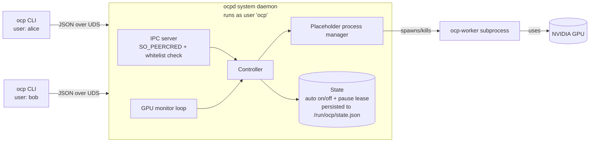

# OCP — Project Plan

A client/server tool ("ocp" = **O**ccupy **C**ompute **P**rocess) that watches GPU utilization & memory and, when the device is idle, launches a placeholder workload to keep it occupied. A CLI client talks to a background daemon.

---

## 1. High-Level Architecture



Three process roles:
1. **`ocp` (client)** — short-lived CLI; sends a request, prints a response.
2. **`ocpd` (system daemon)** — long-lived, runs as a dedicated `ocp` system user under systemd; owns the monitor loop, the IPC server, the placeholder lifecycle, and the small piece of shared state (auto on/off plus the current pause lease). **One daemon per host.**
3. **`ocp-worker` (placeholder)** — child process the daemon spawns to actually consume GPU; killable independently. Runs as the `ocp` user (not as any human user), so `nvidia-smi` clearly distinguishes it from real user jobs.

Separating worker from daemon means the daemon can restart/upgrade without losing the placeholder, and a crashed worker can't take the daemon down. Centralizing the daemon (not one per user) is what makes the pause-lease coordination possible — see §9.

---

## 2. Target Hardware

v1 must run on, and is tested against, both of:

| GPU | Arch | Compute cap. | VRAM | Notes |
|---|---|---|---|---|
| **NVIDIA A100** | Ampere | `sm_80` | 40 / 80 GB HBM2e | Baseline; widely deployed |
| **NVIDIA B200** | Blackwell | `sm_100` | ~180 GB HBM3e | Newer toolchain required (see §3) |

Design implications that follow from supporting both:

- The monitor uses only **generic NVML queries** (`nvmlDeviceGetUtilizationRates`, `nvmlDeviceGetMemoryInfo`, `nvmlDeviceGetComputeRunningProcesses_v3`) that exist on every NVML version that knows the device — no Ampere- or Blackwell-specific APIs in the hot path.
- **MIG-aware enumeration**: both A100 and B200 support MIG. The monitor enumerates parent devices and, if MIG is enabled, also enumerates GI/CI handles; the placeholder is bound to a single MIG instance via `CUDA_VISIBLE_DEVICES=MIG-<uuid>` when applicable. v1 treats each MIG instance as an independent "GPU" from the policy's point of view.
- **Memory sizing is fraction-based, not absolute** (see §8). A 4 GB hardcoded placeholder is meaningless on a 180 GB B200; the worker accepts either `mem_mb` or `mem_frac` and the default config uses the fraction.
- The worker's CUDA kernels must exist for both `sm_80` and `sm_100`. PyTorch ≥ 2.6 with CUDA 12.8+ ships both; older PyTorch wheels will silently JIT-fail or run CPU-fallback on B200, so we pin minimums (§3).

---

## 3. Technology Choices

| Concern | Choice | Why |
|---|---|---|
| Language | **Python 3.10+** | First-class GPU bindings (`pynvml`), good CLI libs, fast to iterate |
| CLI framework | **Typer** (or Click) | Clean subcommand UX, autogenerated `--help` |
| GPU telemetry | **pynvml** (NVIDIA NVML) | Official, no `nvidia-smi` parsing, gives util% + mem |
| IPC transport | **Unix domain socket** + length-prefixed JSON | No port conflicts, filesystem perms = access control |
| Config format | **TOML** (`tomllib` stdlib) | Standard, human-editable |
| Packaging | **`pyproject.toml`** with `[project.scripts]` | Installable via `pip install -e .`, exposes `ocp` / `ocpd` |
| Process supervision | stdlib `subprocess` + signal handling | No extra deps |
| Placeholder workload | **PyTorch** matmul loop on a sized tensor | Easy to tune memory + util independently; AMP optional |

### Toolchain minimums (driven by B200 support)

| Component | Minimum | Reason |
|---|---|---|
| NVIDIA driver | **R570** (≥ 570.86) | First branch with full Blackwell / `sm_100` support; A100 unaffected |
| CUDA runtime (in PyTorch wheel) | **12.8** | First CUDA with `sm_100` codegen |
| PyTorch | **≥ 2.6** built against CUDA 12.8 | Ships prebuilt `sm_80` + `sm_100` kernels |
| `pynvml` (`nvidia-ml-py`) | **≥ 12.560** | Knows Blackwell device IDs and `_v3` process query |

The daemon checks these at startup and refuses to spawn a worker (but stays up for `status`/config) if the toolchain looks too old for an enumerated device, with a clear error in `ocp status`.

AMD/ROCm support is **out of scope** for v1 but the monitor layer will be an interface so it can be added later.

---

## 4. Repository Layout

```
ocp/
├── pyproject.toml
├── README.md
├── src/ocp/
│   ├── __init__.py
│   ├── cli.py              # Typer app; `ocp` entry point
│   ├── daemon.py           # `ocpd` entry point, event loop
│   ├── ipc/
│   │   ├── protocol.py     # Request/Response dataclasses, framing
│   │   ├── server.py       # UDS server (asyncio), SO_PEERCRED extraction
│   │   └── client.py       # Sync client used by CLI
│   ├── auth.py             # uid/name -> whitelist + root check
│   ├── monitor/
│   │   ├── base.py         # GpuSample, GpuMonitor protocol
│   │   └── nvml.py         # pynvml implementation
│   ├── controller.py       # Decides spawn/teardown based on samples + policy
│   ├── lease.py            # Pause lease: acquire/extend/release, expiry, persistence
│   ├── history.py          # Append-only JSONL log + query/format helpers
│   ├── placeholder/
│   │   ├── manager.py      # spawn/kill/health-check worker process
│   │   └── worker.py       # `ocp-worker` entry point (PyTorch loop)
│   ├── config.py           # Load/save TOML, defaults, validation
│   ├── state.py            # Runtime state object (auto on/off, lease, last decision)
│   ├── paths.py            # System paths: /run/ocp, /etc/ocp, /var/log/ocp
│   └── logging_setup.py
├── packaging/
│   ├── ocpd.service        # systemd system unit
│   ├── ocp-tmpfiles.conf   # /run/ocp creation
│   └── ocp-sysusers.conf   # creates 'ocp' system user (no extra group)
└── tests/
    ├── test_controller.py  # Pure-logic tests with fake monitor
    ├── test_protocol.py
    ├── test_config.py
    ├── test_lease.py       # acquire/extend/release/expiry/persistence
    ├── test_history.py     # append, query, rotation, formatting
    ├── test_auth.py        # SO_PEERCRED uid -> whitelist resolution
    └── test_cli_smoke.py   # Spawns a fake daemon over a temp socket
```

---

## 5. CLI Surface (v1)

All commands are thin wrappers that build a request, send it to `ocpd`, print the response. Authorization tiers (enforced by the daemon via `SO_PEERCRED`):

- **Anyone** — read-only commands (`status`, `history`, `config get`, `config path`).
- **Whitelisted** — users listed in `multiuser.whitelist` (by name or uid). Root is always implicitly whitelisted. Can run `pause`, `resume`.
- **Root only** — `on`, `off`, `config reload`. Config is otherwise a static file edited directly with `sudo` + `$EDITOR`.

There is intentionally **no `up`/`down`** — the placeholder lifecycle is fully managed by the auto-detection loop. The only user-facing override is `pause` (yield the GPU) and `resume` (give it back early). Root can disable the whole feature with `off`.

There is intentionally **no `config set`** — the config is a plain TOML file owned by root. To change it: `sudo $EDITOR /etc/ocp/config.toml && sudo ocp config reload`. This keeps the daemon's write surface tiny and makes audit trivial (it's whatever's in git/etckeeper).

| Command | Request | Tier | Behavior |
|---|---|---|---|
| `ocp status` | `GET_STATUS` | anyone | Prints: auto on/off, placeholder running? (pid, gpu idx, mem held), last GPU sample, and — if a pause lease is active — `paused by alice until 14:35 (3m left)`. |
| `ocp on` / `ocp off` | `SET_AUTO {enabled}` | root | Enables/disables the auto-detection loop persistently. `off` tears down any running placeholder and prevents new ones. Has no effect on an active pause lease's deadline (lease semantics are unchanged; under `auto=off` a new `pause` returns `E_AUTO_OFF` since there's nothing to pause from). |
| `ocp pause <duration>` | `PAUSE` | whitelisted | Acquire a lease for `duration` (e.g., `5m`, `90s`, `1h30m`). Tears down any running placeholder immediately and prevents auto from spawning one until the lease expires. Rejected with `E_PAUSE_HELD` if another user already holds a lease (response includes their name and remaining time). The lease-holder may call `pause` again to **extend**; the new deadline is `max(current, now + duration)` — see §6.2. |
| `ocp resume` | `RESUME` | whitelisted (lease holder, or root) | Cancel the active lease early. Returns `E_NO_PAUSE` if none active. Non-holders get `E_NOT_LEASE_HOLDER` (root may force-release). |
| `ocp history [-n N] [--since DUR] [--user U] [--mine]` | `HISTORY_GET` | anyone | Shows recent events (default last 20) with **relative timestamps** ("3m ago"), the actor's username, and the action. Daemon-initiated events show as `(auto)`. |
| `ocp config get [key]` | `CONFIG_GET` | anyone | Prints the in-memory config snapshot (after defaults + validation), or one dotted key. |
| `ocp config reload` | `CONFIG_RELOAD` | root | Re-reads `/etc/ocp/config.toml`, validates, swaps in the new snapshot. Rejected with `E_BAD_CONFIG` on validation failure; the old snapshot stays active. Equivalent to `sudo systemctl reload ocpd` (which sends SIGHUP). |
| `ocp config path` | local | anyone | Prints the config file path. |

Example interactions:

```
$ ocp pause 10m
ok: paused until 14:42 (10m). Auto-detection will resume after that.

$ ocp status
auto:         on
placeholder:  down
paused:       by alice (uid 1001) until 14:42 (7m 23s left)
last sample:  util 0%, mem 0.5 GB / 80 GB

# bob tries while alice's lease is active:
$ ocp pause 5m
error: GPU is currently reserved by alice until 14:42 (7m 23s left).
       Please wait until the lease expires, then try again.
       (E_PAUSE_HELD)

# alice's job finishes early:
$ ocp resume
ok: lease released; auto-detection resumed.

$ ocp history -n 6
14:32:08 (3m ago)   (auto)   placeholder spawned (idle 32s)
14:30:12 (5m ago)   alice    resume
14:25:08 (10m ago)  alice    pause 5m → expires 14:30:12
14:18:55 (16m ago)  bob      (denied) pause 5m — held by alice (4m left)
14:02:00 (33m ago)  root     on
13:55:01 (40m ago)  root     config reload (thresholds.util_low: 5 → 10)
```

Duration parsing: `Ns`/`Nm`/`Nh`/combinations (`1h30m`). Validated against `pause.min_duration_s` and `pause.max_duration_s` (root-set); out-of-range returns `E_PAUSE_TOO_SHORT` / `E_PAUSE_TOO_LONG`.

Global flags: `--json` (machine-readable output), `--socket PATH` (override UDS path).

Hidden/admin (not in the requested list but needed to make v1 usable):
- `ocp daemon start|stop|restart` — manage the daemon when not using systemd.

---

## 6. Daemon Internals

### 6.1 Event loop (asyncio)

Five concurrent tasks share a single `Controller`:

1. **IPC server task** — accepts client connections, extracts caller identity via `SO_PEERCRED`, performs the whitelist/root check, dispatches handlers.
2. **Monitor task** — every `poll_interval_s`, takes a `GpuSample` and feeds the controller.
3. **Supervisor task** — watches the placeholder subprocess; restarts or reports crashes.
4. **Lease expiry task** — sleeps until the active lease's deadline (or forever if no lease), then atomically clears it and lets the controller resume normal decisions on the next monitor tick.
5. **History writer** — a small `asyncio.Queue` consumer that serializes appends to `/var/log/ocp/history.jsonl` so simultaneous events never interleave bytes (§9.5).

A single `asyncio.Lock` guards state transitions (`auto`, `placeholder_state`, `pause_lease`). Lease acquire/extend/release runs under the same lock, so simultaneous `pause` requests from two users are linearizable — the first request wins, the second gets `E_PAUSE_HELD` with the holder's name and remaining time. Every state-changing event (user command or auto decision) is enqueued for the history writer with `{ts, uid, user, cmd, args, ok, error?}`; the lock is released before the enqueue so the IPC reply is not delayed by disk I/O.

### 6.2 Decision policy (controller)

Inputs per tick:
- `util_pct`, `mem_used_mb`, `mem_total_mb` for the configured GPU(s).
- Whether *our* worker is the one consuming.
- Whether a `pause_lease` is currently active.

Rule (configurable):
- **Pause-lease early-out**: if `pause_lease` is active and not yet expired, the controller does nothing this tick (no spawn, no teardown beyond what `pause` itself did at acquire time). The user's job is free to use the GPU; the normal busy/idle logic just stays parked.
- **Idle** when `util_pct < util_low_threshold` AND `mem_used_pct < mem_low_threshold` for `idle_debounce_s` continuously.
- **Busy** when (excluding our own worker's contribution) `util_pct > util_high_threshold` OR `mem_used_pct > mem_high_threshold` for `busy_debounce_s` continuously.

Transitions:
- Idle + auto=on + no placeholder + no active lease → spawn worker; history `(auto) placeholder_spawned`.
- Busy + placeholder is ours → tear worker down (yield to real workload); history `(auto) placeholder_yielded`.
- **Lease acquired**: tear worker down immediately if up; arm the lease expiry task; history `<user> pause <duration>`.
- **Lease expired or released**: do nothing special — the next monitor tick re-evaluates from scratch, using the normal `idle_debounce_s` window. If the user's job ran long and the GPU is still busy, the controller correctly stays parked (no placeholder spawn). History: `<user> resume` or `(auto) lease_expired`.
- **Lease extension**: lease-holder calls `pause` again. New deadline = `max(current_deadline, now + duration)` (never shrinks). Other users still get `E_PAUSE_HELD`. History: `<user> pause <duration> (extend)`.

Debouncing avoids flapping on noisy samples. The worker's own contribution is subtracted by tracking the worker PID and using NVML's per-process accounting (`nvmlDeviceGetComputeRunningProcesses`).

**Lease timing:** the in-memory deadline is a `time.monotonic()` value (immune to wall-clock jumps and suspend/resume). The persisted form (§10) is wall-clock so a daemon restart can recompute remaining time. The lease expiry task uses `asyncio.wait_for` against the monotonic deadline.

### 6.3 Placeholder worker design

The worker exists to occupy exactly the two resources OCP monitors and that real GPU workloads compete for: **HBM** and **SM compute**. These are two **independent dials**, both set per-invocation:

| Resource | Dial | Mechanism |
|---|---|---|
| **HBM** (memory) | `--mem-mb N` or `--mem-frac F` | Pre-allocate a single CUDA tensor of the requested size at startup. Size resolved against NVML's `nvmlDeviceGetMemoryInfo` so the same `mem_frac` behaves sensibly on a 40 GB A100, an 80 GB A100, and a ~180 GB B200. |
| **SM compute** (utilization) | `--util-target <pct>` (0–100) | Tight matmul loop on a separate small working tensor; sleep/work duty cycle calibrated to hit the target. `0` means "hold HBM, run no compute"; `100` means full blast. |

The two dials are intentionally independent: a valid configuration may hold ~80 GB of HBM with 0% compute, or saturate compute with only a few MB of HBM, or anything in between. This matches the policy in §6.2, which evaluates `util_pct` and `mem_used_pct` against separate thresholds.

Invocation: `ocp-worker --gpu <idx-or-mig-uuid> [--mem-mb N | --mem-frac F] --util-target <pct>`. Implementation details:

- Matmul dtype: BF16 on both A100 and B200 (uses tensor cores on either arch, so `util_target` is hit at modest power draw). FP8 left as a future option for B200 only.
- The duty-cycle calibration runs for the first few seconds against the *observed* utilization, then locks in: Blackwell finishes the same matmul much faster than Ampere, so a fixed sleep would over- or under-shoot.
- Handles `SIGTERM` cleanly: free tensor, exit 0.
- Heartbeats by writing to stdout/log so the supervisor knows it's alive.

Deliberate non-targets: PCIe bandwidth, NVLink traffic, power draw, video-encoder/decoder engines. The worker does **not** try to occupy those — the monitor doesn't watch them and a placeholder that fights for them would hurt unrelated workloads.

This is intentionally a separate process so:
- Killing it instantly releases VRAM.
- A CUDA OOM in the worker can't crash the daemon.
- Users can `kill -9` it manually in emergencies.

---

## 7. IPC Protocol

- **Transport**: UDS at `/run/ocp/ocpd.sock`, owner `ocp:ocp`, mode `0666`. Any local user can connect to issue read-only commands; mutating commands are authorized by the daemon (no POSIX group required).
- **Identity**: the server calls `getsockopt(SO_PEERCRED)` on every accepted connection to obtain the client's `pid/uid/gid` from the kernel. The client cannot spoof its identity — any `actor` field in a request body is ignored. The username is resolved via `pwd.getpwuid`.
- **Authorization**: three tiers, evaluated per command (see §5):
  - *anyone* — `GET_STATUS`, `HISTORY_GET`, `CONFIG_GET`.
  - *whitelisted* — the caller's uid OR username is in `multiuser.whitelist`. Root (uid 0) is always implicitly whitelisted. Required for `PAUSE`, `RESUME`.
  - *root* — uid 0 only. Required for `SET_AUTO`, `CONFIG_RELOAD`.
- **Framing**: 4-byte big-endian length + UTF-8 JSON body.
- **Message shape**:
  ```json
  // request
  { "v": 1, "id": "uuid", "cmd": "PAUSE", "args": { "duration_s": 300 } }

  // success response
  { "v": 1, "id": "uuid", "ok": true,
    "data": { "lease": { "user": "alice", "uid": 1001,
                          "expires_at": 1747000600, "remaining_s": 300 } } }

  // error response
  { "v": 1, "id": "uuid", "ok": false,
    "error": { "code": "E_PAUSE_HELD",
               "msg": "GPU is currently reserved by alice until 14:42 (7m 23s left).",
               "data": { "holder": "alice", "remaining_s": 443 } } }
  ```
- Error code vocabulary (non-exhaustive): `E_NOT_WHITELISTED`, `E_NOT_ROOT`, `E_NOT_LEASE_HOLDER`, `E_PAUSE_HELD`, `E_PAUSE_TOO_SHORT`, `E_PAUSE_TOO_LONG`, `E_NO_PAUSE`, `E_AUTO_OFF` (returned by `PAUSE` when `auto=off`), `E_BAD_DURATION`, `E_BAD_CONFIG` (returned by `CONFIG_RELOAD` when the file fails to parse or validate; the previous snapshot stays in effect), `E_NVML`, `E_BAD_REQUEST`.
- Versioned via the `"v": 1` field; client refuses mismatched majors.

Security: identity is kernel-attested via `SO_PEERCRED`; authorization is enforced in the daemon; no network exposure.

---

## 8. Config File

Path: **`/etc/ocp/config.toml`**, owner `root:root`, mode `0644`. The file is **static** — only root can edit it (with `sudo $EDITOR`); the daemon only ever *reads* it. There is no in-band write path; `ocp config set` does not exist. To change anything: edit the file as root, then run `sudo ocp config reload` (or `sudo systemctl reload ocpd`, which sends SIGHUP).

The daemon reloads atomically: parse + validate the new file into a candidate snapshot; only if both succeed does it swap into the live snapshot. On failure the previous snapshot stays in effect and `CONFIG_RELOAD` returns `E_BAD_CONFIG` with the parse/validation error. This means a syntactically broken edit cannot take the daemon down.

```toml
[general]
auto = true
poll_interval_s = 2.0
log_level = "INFO"

[gpu]
indices = [0]              # which GPUs to watch; [] = all

[thresholds]
util_low = 5               # %
util_high = 30
mem_low = 10               # % of total
mem_high = 50
idle_debounce_s = 30
busy_debounce_s = 5

[placeholder]
# Pick exactly one of mem_frac or mem_mb. mem_frac scales correctly
# across A100 (40/80 GB) and B200 (~180 GB).
mem_frac = 0.5             # fraction of the bound device's total VRAM
# mem_mb = 4096            # absolute override; takes precedence if set
util_target = 90           # 0-100; 100 = full blast
nice = 19                  # OS niceness for the worker

[multiuser]
# Users allowed to run pause/resume. Entries are matched as usernames
# first, then as numeric uids. Root (uid 0) is always allowed and need
# not appear here.
whitelist = ["alice", "bob", 1042]

[pause]
default_duration_s = 600   # used when CLI duration arg is omitted (if ever supported)
min_duration_s     = 30    # reject anything shorter
max_duration_s     = 7200  # hard ceiling (2h). Root sets this.

[history]
# Hard cap on retained history entries. The on-disk file is bounded
# to this many lines; older entries are dropped, FIFO. This is also
# the size of the in-memory ring used to serve HISTORY_GET fast.
max_entries = 1000
```

**Reload semantics:**

- Whitelist edits take effect immediately for **new** connections; in-flight requests use the snapshot taken at accept time.
- Changing `pause.max_duration_s` does **not** retroactively shrink an already-issued lease.
- Changing `general.auto` via the file is equivalent to running `ocp on`/`ocp off`; either way the new value persists across daemon restarts because it's read from the file at startup.
- Reloads are recorded in the history log as `root config_reload` (or `(auto) config_reload` when triggered by SIGHUP without an IPC caller).

---

## 9. Multi-User Model

The daemon is **shared by all users on the host**, but the model is intentionally minimal: one authoritative pause lease, plus a small whitelist for who can touch it.

### 9.1 Identity (no spoofing)

The IPC server obtains `(pid, uid, gid)` from the kernel via `SO_PEERCRED` on every connection. The username is resolved via `pwd.getpwuid`. Any `actor` field in a request body is ignored.

### 9.2 Three-tier authorization

| Tier | Who | Commands |
|---|---|---|
| Anyone | every local user | `status`, `history`, `config get`, `config path` |
| Whitelisted | uid 0, or uid/name in `multiuser.whitelist` | + `pause`, `resume` |
| Root | uid 0 only | + `on`, `off`, `config reload` (config is otherwise edited directly as root) |

The socket itself is world-connectable (`0666`); all authorization happens in the daemon based on the kernel-attested uid. Non-whitelisted users attempting a mutating command get `E_NOT_WHITELISTED` with the exact set of currently-allowed users named so they know who to ask.

### 9.3 Pause lease (the only coordinated resource)

State shape: at most **one** active lease, held in memory and persisted to `/run/ocp/state.json`:

```json
{ "lease": { "uid": 1001, "user": "alice",
             "acquired_at": 1747000000,
             "expires_at":  1747000600 } }
```

Lifecycle:

- **Acquire** (`PAUSE`): under the controller lock, check `auto=on`, check no other lease is active, validate duration against `pause.min_duration_s` / `pause.max_duration_s`, tear down any running placeholder, install the lease, persist, arm the expiry task.
- **Extend** (`PAUSE` by the same uid): allowed any time before expiry. New deadline is `max(current, now + duration)`; cannot shrink. Re-validated against `max_duration_s` from the original acquisition time, not cumulatively, so a user can keep extending in normal-sized chunks.
- **Release early** (`RESUME`): only the lease-holder (or root) can do this. Clears the lease, persists, cancels the expiry task. The next monitor tick re-evaluates normally with the usual debounce — i.e., no immediate respawn.
- **Timer expiry**: the lease expiry task fires, clears the lease atomically, persists. Same re-evaluation behavior as release.
- **Daemon restart with an active lease**: on startup, load `state.json`. If `expires_at > wall_now`, restore the lease with `remaining_s = expires_at - wall_now` and re-arm. If already expired, drop it.

Timing: the in-memory deadline used by the expiry task is `time.monotonic()`-based so NTP jumps and suspend/resume can't grant or steal time mid-session. The persisted `expires_at` is wall-clock so it can survive a restart.

### 9.4 Conflict messaging

There is **no broadcast/notification channel**. Conflict awareness happens at three places:

1. `ocp status` always shows the active lease holder and remaining time.
2. A `PAUSE` request that loses the race returns `E_PAUSE_HELD` whose message embeds the holder's name and remaining time; the CLI prints it verbatim. The denial is also recorded to history so a later `ocp history` shows it.
3. `ocp history` answers "who did what when" on demand (§9.5).

This is intentional: the daemon serializes the actual transitions, so users can't deadlock; humans only need to know "who is using it right now," which `status` answers — and "who used it lately," which `history` answers.

### 9.5 Shared command history

A single append-only JSONL file at **`/var/log/ocp/history.jsonl`**, owner `ocp:ocp`, mode `0644` (world-readable). One JSON object per line; the daemon is the **sole writer** (via the history-writer task in §6.1) so there is no multi-writer interleaving to worry about.

Entry shape:

```json
{ "ts":     1747000300,                  // wall-clock seconds since epoch
  "uid":    1001,                        // 0 for auto-decisions
  "user":   "alice",                     // "(auto)" for daemon-initiated events
  "cmd":    "pause",                     // see list below
  "args":   { "duration_s": 300 },
  "ok":     true,
  "error":  null,                        // error code if ok=false
  "note":   "expires 14:30:12" }         // optional human-readable detail
```

Recorded `cmd` values:

| cmd | who | when |
|---|---|---|
| `pause` / `resume` | user | every request (success or denial) |
| `on` / `off` | root | every request |
| `config_reload` | root or `(auto)` | every reload, whether IPC- or SIGHUP-triggered; failures recorded with `ok=false` and `E_BAD_CONFIG` |
| `placeholder_spawned` | `(auto)` | controller spawns the worker |
| `placeholder_yielded` | `(auto)` | controller tears down because of real workload |
| `placeholder_crashed` | `(auto)` | supervisor detects unexpected worker exit |
| `lease_expired` | `(auto)` | lease deadline reached |
| `nvml_error` | `(auto)` | monitor encounters NVML failure |

Read paths:

1. `HISTORY_GET` over IPC — the daemon serves a paged view from its in-memory ring (size `history.max_entries`, see below). All retained entries fit in the ring, so disk reads are never needed for queries.
2. Direct file read — the file is world-readable, so `tail -f /var/log/ocp/history.jsonl | jq` works without involving the daemon. The schema above is therefore a **stable interface**. Note `tail -f` may briefly see the file shrink during a compaction (see below); consumers should be prepared to reopen.

**Bounded size (no logrotate):** the history is capped at exactly `history.max_entries` lines (default 1000). The daemon keeps an in-memory ring of that size; on startup it loads the file into the ring, dropping anything beyond the cap. On every event it appends one line to disk **and** pushes to the ring. When the on-disk line count exceeds `max_entries * 1.2`, the daemon **compacts** the file atomically: write the current ring to a tempfile, `fsync`, `rename` over the live file. Compaction is bounded work (rewrite ~1.2k lines, a few hundred KB at most) and runs at most every ~200 events. Result: the file size is bounded, no external logrotate is required, and queries are always served from memory in O(1) per entry.

Consequences worth knowing:

- `ocp history --since 30d` may return fewer entries than expected if more than `max_entries` events occurred in that window — the oldest are simply gone. The CLI prints a one-line hint when its query was truncated by the cap.
- Raising `max_entries` via config reload takes effect on the next event (the ring grows). Lowering it trims oldest entries immediately on the next compaction.

### 9.6 Notes for operators

- Install creates the `ocp` system user (no extra POSIX group) via `sysusers.d`.
- `/run/ocp` is created by `tmpfiles.d` at boot.
- Because the worker runs as the `ocp` user (not as the invoking human), `nvidia-smi` shows it owned by `ocp` — useful for distinguishing the placeholder from real user jobs.
- **Config changes are out-of-band**: edit `/etc/ocp/config.toml` as root with `$EDITOR`, then `sudo ocp config reload` (or `sudo systemctl reload ocpd`). The file is the single source of truth — keep it in `etckeeper`/git for audit.

---

## 10. Lifecycle & Failure Handling

- **Deployment**: `ocpd` runs as a **systemd system service** (`/etc/systemd/system/ocpd.service`), `User=ocp`, `Group=ocp`, `SupplementaryGroups=video render` (for GPU access). Started at boot; restarts on failure. The `ocp` user is created at install via `sysusers.d`; `/run/ocp` via `tmpfiles.d`.
- **Daemon startup**: ensure socket dir exists with correct perms, take a PID-file lock at `/run/ocp/ocpd.pid` (refuse double-start), open NVML, load config, **load `/run/ocp/state.json` and restore any unexpired pause lease**, open `/var/log/ocp/history.jsonl` in append mode (creating it `0644` if missing) and emit a `daemon_started` entry, start asyncio loop. `--foreground` mode for systemd / debugging.
- **Daemon shutdown** (SIGTERM): close IPC server, kill worker (graceful), drain the history queue, persist final state (lease, if any), emit a `daemon_stopped` history entry, shutdown NVML, remove socket and pidfile. The pause lease is **preserved across restarts**.
- **SIGHUP**: reload config from `/etc/ocp/config.toml`. On a parse/validation failure the previous in-memory snapshot stays active; a `(auto) config_reload ok=false E_BAD_CONFIG` entry is appended to history and an error is logged. (The history file is managed in-process and does not need a SIGHUP-driven reopen; the daemon log uses Python's `RotatingFileHandler`.)
- **State persistence**: `/run/ocp/state.json` is rewritten atomically (`write tempfile + rename`) on every lease acquire/extend/release and on graceful shutdown. `/run` is a tmpfs that is wiped on reboot — a host reboot intentionally clears all leases (a stale lease across reboots would surprise users).
- **Client when daemon down**: connection error → print a clear hint (`systemctl status ocpd`; or `sudo systemctl start ocpd`).
- **Client whose uid isn't whitelisted**: clear message naming the command they tried and the current whitelist; suggests asking root to edit `/etc/ocp/config.toml` and run `sudo ocp config reload`.
- **Worker crash**: supervisor logs it, marks placeholder as down, does *not* auto-respawn within `restart_backoff_s` to avoid loops.
- **GPU disappears / driver reset**: monitor task catches NVML errors, surfaces in `status`, disables auto until next successful poll.

---

## 11. Logging & Observability

- **Daemon log** (free-form ops): rotating file at `/var/log/ocp/ocpd.log` + stderr in foreground mode. Owner `ocp:ocp`, mode `0640`. Contains diagnostics, monitor errors, supervisor events. (Rotation here is by size via Python's `RotatingFileHandler`; no external logrotate dependency.)
- **History log** (structured audit): `/var/log/ocp/history.jsonl`, mode `0644`. Capped at `history.max_entries` lines (default 1000) by the daemon itself — see §9.5. Distinct from the daemon log because it is a stable, world-readable interface, not free-form text.
- `ocp status --json` exposes the latest sample + decision rationale + active lease (useful for debugging policy tuning and seeing who reserved the GPU).
- (Future) `ocp logs -f` tails the daemon log; `ocp history -f` tails the history JSONL.

---

## 12. Testing Strategy

- **Unit**: `Controller` is pure; feed scripted `GpuSample` sequences, assert state transitions, debounce behavior, and that the pause-lease early-out blocks spawn while active.
- **Unit**: `lease` module — acquire/extend/release/expiry edge cases; extension never shrinks the deadline; only holder or root can release; persistence round-trip; restart with expired lease drops it.
- **Unit**: protocol round-trip (encode → decode), config validation edge cases, duration parser (`5m`, `1h30m`, `0s` rejected, etc.).
- **Unit**: `auth` — fake `SO_PEERCRED` results, verify whitelist matching by name and by uid, and that root is implicitly allowed.
- **Unit**: `history` — append round-trip, query filters (`-n`, `--since`, `--user`, `--mine`), relative-time formatter, **bounded-cap compaction** (file never exceeds ~`1.2 * max_entries` lines; ring always holds the last `max_entries` entries; restart restores the ring from a possibly-pre-compaction file), no byte-interleaving under concurrent enqueues.
- **Integration**: spin up daemon against a `FakeMonitor`, drive it via a real UDS client, assert `status` shows the lease, assert second-user `PAUSE` is rejected with `E_PAUSE_HELD` carrying the correct holder + remaining time.
- **Integration (multi-user)**: run the daemon as a temp user with a temp socket; have two child processes acting as different uids issue `pause` simultaneously, verify exactly one wins and the other's error message names the winner.
- **Integration (restart)**: acquire a lease, kill the daemon, restart it, verify the lease is restored and the remaining time is correct (within tolerance).
- **Smoke (manual / opt-in)**: real GPU test that spawns the worker for 5s and checks NVML reports its PID. Run on **both A100 and B200** before tagging a release; also exercise an A100 MIG-enabled host to confirm per-instance binding.
- CI runs everything except the GPU smoke test.

---

## 13. Milestones

1. **M1 — Skeleton**: pyproject, package layout, `ocp --help`, `ocpd` that just logs.
2. **M2 — IPC + auth**: UDS server/client with `SO_PEERCRED`, whitelist + root tier checks, `ocp status` returns a stub including caller identity.
3. **M3 — Monitor**: NVML wrapper + `GpuSample`; `status` shows live numbers.
4. **M4 — Placeholder**: `ocp-worker` + manager spawned automatically when controller decides; no user CLI yet.
5. **M5 — Auto policy + pause**: controller with debounce; `ocp on` / `ocp off` (root); pause lease with acquire/extend/release/expiry and `/run/ocp/state.json` persistence; `ocp pause` / `ocp resume`.
6. **M6 — History**: world-readable JSONL, history writer task, `HISTORY_GET`, `ocp history` with filters and relative-time formatting; auto-decisions and denials recorded.
7. **M7 — Config**: TOML load + validation, `ocp config get`, `ocp config reload` (root) + SIGHUP, atomic snapshot swap on success, no-op rollback on failure.
8. **M8 — Packaging & polish**: systemd unit, sysusers/tmpfiles configs, README, tests.

---

## 14. Explicit Non-Goals (v1)

- Cross-host coordination (one daemon per host; nothing federated).
- Per-user quotas, fair-share scheduling, or queues for the pause lease (first request wins; whoever waits, waits).
- Manual `up`/`down` commands. Placeholder lifecycle is auto-managed; users only `pause`/`resume`, root toggles the whole feature with `on`/`off`.
- In-band config writes. `ocp config set` does not exist; root edits the static TOML file with `sudo $EDITOR` and reloads. Audit lives in the file's version control, not in the daemon.
- Auto-watching the config file for changes (no inotify). Reloads are explicit so root knows exactly when a change went live.
- Push notifications when a lease is released or about to expire. Users poll `ocp status` or `ocp history`.
- PAM, LDAP, or per-command policy beyond the three tiers in §9.2.
- Non-NVIDIA GPUs (AMD/ROCm, Intel). NVIDIA pre-Ampere (V100 and older) is best-effort only — code should not break, but it's not in the test matrix.
- FP8 placeholder kernels (Blackwell-only) — deferred; BF16 is enough to saturate either GPU.
- Reconfiguring MIG layout from `ocp` (we read it, we don't change it).
- Remote control over TCP.
- Fancy TUI.
- Cgroup-based resource limits on the worker.

These are left as clean extension points (monitor interface, transport abstraction, separate worker binary, whitelist-based auth that can be swapped for a richer authorizer) rather than implemented now.
